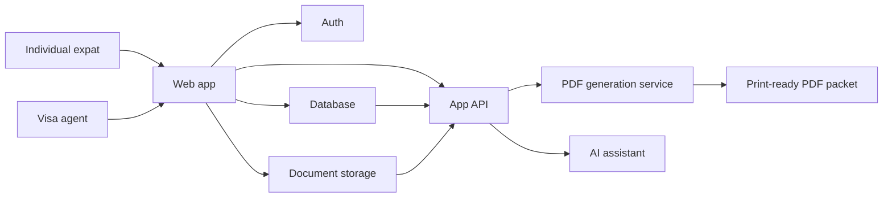

# VisaFiler AI PRD

## 1. Overview

**Product name:** VisaFiler AI

**One-liner:** VisaFiler AI helps Thailand expats and visa agents turn stored client details and uploaded documents into completed, print-ready immigration form packets.

**Primary wedge:** Thailand visa and immigration admin, starting with TM.7 extension forms and expanding to related long-stay workflows.

**Primary users:**

- Individual expats, retirees, digital nomads, and long-stay visitors in Thailand.
- Visa agents and relocation consultants managing paperwork for multiple clients.

**Problem:** Thai immigration paperwork is repetitive, deadline-sensitive, and detail-heavy. Many forms are flat PDFs, not proper digital forms. Expats repeatedly enter the same passport, address, arrival, visa, TM30, and personal details across forms. Visa agents spend staff time collecting the same information, chasing missing documents, and manually preparing packets.

**Product objective:** Reduce a visa form packet from a manual, error-prone task into a guided workflow where the user uploads/selects a form, confirms missing details, reviews the output, and exports a print-ready PDF packet.

**MVP magic moment:** A user uploads a flat TM.7 PDF, selects their saved profile, answers only missing questions, and receives a completed print-ready PDF in under five minutes.

## 2. Scope

### MVP In Scope

- Personal profile vault for one expat.
- Agent workspace for managing multiple client profiles.
- Stored passport, identity, arrival, address, visa, TM30, and contact details.
- Upload flat PDF forms.
- Template-backed filling for TM.7.
- AI-assisted extraction of visible form labels and missing required fields.
- Guided missing-information questions.
- Print-ready completed PDF export.
- Manual preview/approval before export.
- Basic document checklist for each workflow.
- File attachment storage for passport, TM30, arrival stamp, visa page, address proof, photo, and supporting documents.

### MVP Out Of Scope

- Direct submission to Thai immigration systems.
- Legal advice or guarantee of approval.
- Full OCR for every unknown government form.
- Chrome extension autofill.
- Healthcare prior authorization.
- Generic "fill any form" marketplace.
- Payments in the first internal prototype.
- Mobile-native apps.

## 3. Target Workflows

### Workflow 1: Individual TM.7 Extension

1. User creates a personal profile.
2. User enters passport, arrival, address, visa, TM30, and contact details.
3. User uploads or selects the TM.7 form template.
4. System maps stored data to known TM.7 fields.
5. System asks for missing items such as extension reason or application date.
6. User reviews a PDF preview.
7. User exports a completed PDF packet.

### Workflow 2: Visa Agent Client Intake

1. Agent creates a client profile or sends an intake link.
2. Client enters details and uploads supporting documents.
3. Agent sees completion status and missing items.
4. Agent selects the required immigration workflow.
5. System generates completed PDFs and a checklist.
6. Agent reviews, downloads, prints, and files the packet.

## 4. User Personas

### Expat Self-Serve User

**Profile:** Retiree, long-stay tourist, digital nomad, spouse visa applicant, or repeat Thailand visitor.

**Pain points:**

- Does not know which details go where.
- Worries about mistakes on official forms.
- Re-enters the same data repeatedly.
- Keeps documents scattered across folders and email.
- Wants print-ready output because many immigration workflows remain paper-based.

**Success criteria:**

- Can complete a TM.7 packet without manually typing into a PDF editor.
- Knows what information or documents are still missing.
- Can reuse the profile for the next extension.

### Visa Agent / Relocation Consultant

**Profile:** Small visa agency, legal assistant, relocation consultant, condo/rental support service, or admin helping foreign clients.

**Pain points:**

- Staff manually collect and re-enter client data.
- Missing documents delay appointments.
- Repetitive form prep limits throughput.
- Client information is spread across WhatsApp, email, PDFs, and spreadsheets.

**Success criteria:**

- Can manage multiple clients in one dashboard.
- Can quickly see missing details.
- Can generate consistent form packets.
- Reduces admin time per client.

## 5. Product Requirements

### FR-001 Profile Vault

Users can create, edit, and store reusable profile data.

**Priority:** P0

**Fields:**

- Legal name, nationality, date of birth, place of birth.
- Passport number, issue date, expiry date, issued-at location.
- Visa type, arrival date, port of arrival, arrived by, origin country/city.
- TM.6 number where applicable.
- Thailand address: number, building/street, sub-district, district, province, post code.
- Contact details.
- Optional spouse/family details for later workflows.

**Acceptance criteria:**

- Profile can be created and edited.
- Required fields are clearly marked by workflow, not globally.
- User can see profile completeness for TM.7.

### FR-002 Document Vault

Users can upload and store supporting documents.

**Priority:** P0

**Document types:**

- Passport photo page.
- Visa page/stamp.
- Arrival stamp.
- TM30 receipt.
- Address proof.
- Passport photo.
- Signature image.
- Other supporting documents.

**Acceptance criteria:**

- Upload accepts PDF, PNG, JPG, and JPEG.
- Each document can be assigned a type.
- Documents can be attached to a generated packet.

### FR-003 TM.7 Template Filler

The app can generate a completed TM.7 PDF from a saved profile.

**Priority:** P0

**Behavior:**

- Use a known coordinate map for the official TM.7 PDF.
- Fill stable profile fields.
- Ask for missing workflow-specific details.
- Leave signature/photo fields blank unless user explicitly provides signature/photo assets.

**Acceptance criteria:**

- Completed PDF preserves the original form layout.
- Output is printable.
- User can regenerate after editing details.
- Exported PDF filename includes client name, form type, and date.

### FR-004 Missing Information Assistant

The app asks only for details missing from the selected workflow.

**Priority:** P0

**Examples:**

- Reason for extension.
- Application date.
- Written-at location.
- Port of arrival.
- Passport issued-at location.

**Acceptance criteria:**

- User sees a clear missing-info checklist.
- Filling a missing item updates the profile or workflow instance as appropriate.
- The app distinguishes reusable profile data from one-time form data.

### FR-005 PDF Preview And Approval

Users can preview generated forms before download.

**Priority:** P0

**Acceptance criteria:**

- Preview shows each page.
- User can go back and edit details.
- User must approve before final export.

### FR-006 Agent Workspace

Agents can manage multiple clients.

**Priority:** P1 for MVP, P0 for B2B pilot

**Capabilities:**

- Client list.
- Client profile.
- Missing document/status indicators.
- Form packet generation per client.

**Acceptance criteria:**

- Agent can create at least 25 client profiles.
- Agent can filter by missing info, ready to generate, and generated.
- Agent can download a completed packet for a client.

### FR-007 Intake Link

Agents can send a client intake link.

**Priority:** P1

**Behavior:**

- Client fills profile details and uploads documents.
- Agent can review submissions.
- Client does not need full workspace access.

**Acceptance criteria:**

- Link is scoped to one client.
- Agent can disable the link.
- Submitted details are visible in the agent dashboard.

### FR-008 Form Template Library

The system stores reusable form definitions.

**Priority:** P0

**Initial template:**

- TM.7 extension form.

**Thailand form roadmap:**

- TM.47 / 90-day report.
- TM.8 re-entry permit.
- TM.30-related packet support.
- Passport copy packet generator.
- Photo/signature/document checklist.
- Retirement visa extension packet.
- Marriage/family visa packet.
- Education visa support packet.
- DTV / long-stay support checklist where applicable.
- Bank letter request packet.
- Proof-of-funds checklist.
- Address proof and landlord document checklist.
- Driving licence paperwork.

**Acceptance criteria:**

- Each template has field mappings, required data definitions, and output filename rules.
- Templates can be versioned when official forms change.
- Templates support country and jurisdiction metadata so the same architecture can later support Southeast Asia expansion.

## 6. AI Requirements

### AI-001 Form Understanding

For known templates, AI should not guess coordinates. It should use verified mappings. For unknown PDFs, AI can assist by extracting visible labels and suggesting a draft field map for human review.

**Acceptance criteria:**

- Known TM.7 output uses deterministic coordinates.
- Unknown-form suggestions are marked as unverified.
- User or admin must approve unknown mappings before final use.

### AI-002 Missing Field Reasoning

AI can explain what a missing field likely means in plain language.

**Example:** "Written at usually means the city or office location where the form is prepared or submitted, such as Phuket."

**Acceptance criteria:**

- AI explanations are informational, not legal advice.
- The app shows confidence and asks the user to confirm.

### AI-003 Document Data Extraction

Later versions can extract passport numbers, dates, names, and arrival stamp details from uploaded documents.

**MVP status:** Optional P2 unless OCR is easy to add.

## 7. Data Model

### User

- `id`
- `email`
- `name`
- `role`: `individual`, `agent`, `admin`
- `createdAt`
- `updatedAt`

### Organization

- `id`
- `name`
- `type`: `visa_agent`, `relocation_consultant`, `individual`
- `ownerUserId`
- `createdAt`

### ClientProfile

- `id`
- `organizationId`
- `ownerUserId`
- `legalFirstName`
- `legalMiddleName`
- `legalFamilyName`
- `nationality`
- `dateOfBirth`
- `placeOfBirth`
- `passportNumber`
- `passportIssueDate`
- `passportExpiryDate`
- `passportIssuedAt`
- `visaType`
- `arrivalDate`
- `arrivedBy`
- `arrivalFrom`
- `portOfArrival`
- `tm6Number`
- `thaiAddressLine`
- `thaiAddressNumber`
- `road`
- `subDistrict`
- `district`
- `province`
- `postCode`
- `phone`
- `email`
- `createdAt`
- `updatedAt`

### Document

- `id`
- `clientProfileId`
- `type`
- `fileName`
- `mimeType`
- `storagePath`
- `uploadedByUserId`
- `createdAt`

### FormTemplate

- `id`
- `code`
- `name`
- `country`
- `category`
- `version`
- `sourcePdfPath`
- `fieldMap`
- `requiredFields`
- `createdAt`
- `updatedAt`

### FormPacket

- `id`
- `clientProfileId`
- `templateId`
- `status`: `draft`, `missing_info`, `ready_for_review`, `approved`, `exported`
- `workflowData`
- `generatedPdfPath`
- `createdByUserId`
- `approvedByUserId`
- `createdAt`
- `updatedAt`

## 8. Suggested Technical Architecture

### Recommended MVP Stack

- **Frontend:** Next.js web app.
- **Backend:** Next.js API routes or server actions for the first version.
- **Database:** Postgres via Supabase or Neon.
- **File storage:** Supabase Storage, S3-compatible storage, or Cloudflare R2.
- **Auth:** Clerk or Supabase Auth.
- **PDF generation:** `pypdf`/`reportlab` via a Python worker, or Node PDF libraries if deployment simplicity matters.
- **AI:** OpenAI API for form label reasoning, missing-field explanations, and later extraction.
- **Deployment:** Vercel for web app plus a serverless/background worker where PDF rendering is supported.

### Architecture Diagram

## 9. Security And Privacy

The product stores highly sensitive identity and immigration data. Security is a core product requirement, not a polish item.

**Requirements:**

- Encrypt files at rest through storage provider controls.
- Use HTTPS only.
- Restrict each client profile to its owner organization.
- Log packet generation events.
- Do not train models on user documents.
- Provide delete/export account data controls.
- Avoid sending full document contents to AI unless required for a specific action.
- Mask passport numbers in list views.

## 10. UX Requirements

### Screens

- Landing or login screen.
- Dashboard.
- Profile vault.
- Client list for agents.
- Client detail page.
- Document vault.
- New form packet workflow.
- Missing information checklist.
- PDF preview.
- Export/download screen.

### UX Principles

- The first screen after login should be operational, not marketing-heavy.
- Use checklist-driven workflows.
- Separate reusable profile details from one-time form answers.
- Always show what is complete, missing, and ready.
- Every generated form needs a review step before export.

## 11. Monetization

### Individual Pricing

Individual expat pricing should avoid monthly churn because visa admin is episodic. Users need help when extensions, reports, renewals, or document packets come due, not every week.

**Recommended launch model:**

- Free trial: create profile, checklist, and preview a watermarked PDF.
- Single form packet: THB 299 to THB 499.
- 12-month Expat Pass: THB 990 to THB 1,490 per year.
- Couple/family pass: THB 1,990 per year.

**Recommended starting price:** THB 1,290 per year after a free preview trial.

The yearly pass should include the profile vault, supported form generation, renewal reminders, checklists, document storage, and a limited number of generated packets.

### Visa Agent Pricing

Agents use the product repeatedly and save staff time, so SaaS pricing is appropriate.

**Recommended launch model:**

- Starter: THB 1,990 per month for small agents.
- Pro: THB 4,990 per month for busy agents.
- Agency: THB 9,900+ per month for teams, branded intake links, and larger client volumes.
- Annual option: two months free.
- Optional overage: THB 50 to THB 100 per extra generated packet after included limits.

**Recommended starting price:** THB 2,990 per month or THB 29,900 per year for early visa-agent customers.

### Recommended First Pricing Tests

- Test whether expats prefer one-off packet pricing or a 12-month pass.
- Test whether agents prefer active-client limits or packet-generation limits.
- Test an annual individual plan anchored against the cost of one agent-assisted extension.

## 12. Success Metrics

- Time to completed TM.7 PDF.
- Percentage of packets generated without manual PDF editing.
- Number of missing-info questions per packet.
- Agent clients processed per month.
- Repeat usage rate for renewals.
- PDF generation error rate.
- Support tickets per packet.

## 13. Risks

### Risk: Official forms change

**Mitigation:** Version form templates and keep old packets tied to the template version used.

### Risk: Users treat the app as legal advice

**Mitigation:** Use clear copy: the app prepares paperwork but does not provide immigration/legal advice.

### Risk: Privacy concerns block adoption

**Mitigation:** Make data deletion, export, encryption, and "AI only when needed" visible product features.

### Risk: Generic competitors copy the feature

**Mitigation:** Win through Thailand-specific templates, checklists, agent workflows, and local knowledge.

### Risk: PDF placement accuracy

**Mitigation:** Use deterministic template mappings for supported forms and require preview approval.

## 14. Future Expansion

### Thailand Form Expansion

Thailand remains the first market. Expand only after the TM.7 workflow is reliable.

**Phase 1: Thailand Core**

- TM.7 extension of temporary stay.
- TM.30 support packet / address notification evidence.
- TM.47 90-day report.
- TM.8 re-entry permit.
- Passport copy packet generator.
- Photo/signature/document checklist.

**Phase 2: Thailand Long-Stay**

- Retirement visa extension packets.
- Marriage/family visa packet support.
- Education visa support packet.
- DTV / long-stay support checklist where applicable.
- Bank letter / proof-of-funds checklist.
- Address proof and landlord document checklist.
- Driving licence paperwork.
- Bank/KYC forms.
- Insurance claim packets for expats.

### B2B Agent Operations

- Team roles.
- Client reminders.
- Appointment tracking.
- Packet status pipeline.
- Branded client intake portals.
- Internal notes.

### Southeast Asia Expansion

Southeast Asia should be designed for but not built into the MVP. Every country has different rules, forms, local office practices, languages, and document expectations. The product should therefore start with Thailand and expand country by country only after the form-template system, profile vault, and agent workflow are proven.

**Candidate next markets:**

- Vietnam.
- Indonesia / Bali.
- Philippines.
- Malaysia.
- Cambodia.

**Implementation requirement:** form templates must include country, region/office, language, source-form version, required profile fields, required supporting documents, and output-packet rules. This prevents the product from becoming a generic unstructured form filler as it expands.

### Separate Future Vertical

Healthcare prior authorization is a strong future opportunity but should be treated as a separate product line because it requires different compliance, buyers, integrations, and domain workflows.

## 15. Open Questions

- Product name: keep VisaFiler AI or choose a Thailand-specific name?
- Should the first release be individual self-serve, B2B agent-first, or both with one shared codebase?
- Which Thai immigration forms should follow TM.7?
- Should signatures/photos be placed automatically or left blank by default?
- Should the app store documents long term, or generate packets from temporary uploads for privacy-sensitive users?
- Should the first prototype be local desktop, web app, or web app plus desktop wrapper?

## 16. MVP Build Recommendation

Build the first prototype as a web app with one complete workflow:

**Create profile -> select TM.7 -> answer missing questions -> preview -> export PDF.**

Then add the agent dashboard after the individual workflow is reliable. This keeps the first build small while preserving the B2B direction.
